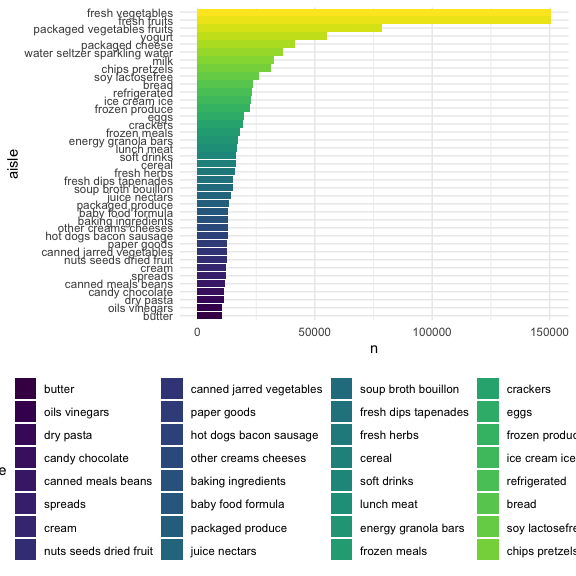
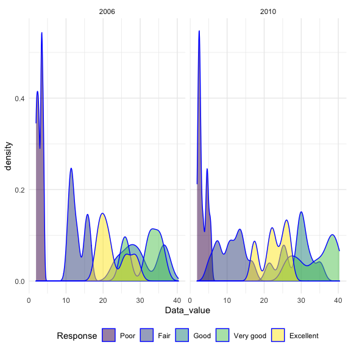
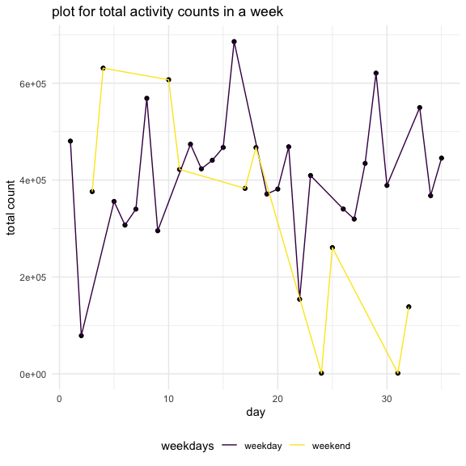

p8105\_hw3\_zh2494
================
zhuolun
10/15/2021

``` r
library(p8105.datasets)
library(tidyverse)
```

    ## ── Attaching packages ─────────────────────────────────────── tidyverse 1.3.1 ──

    ## ✓ ggplot2 3.3.5     ✓ purrr   0.3.4
    ## ✓ tibble  3.1.4     ✓ dplyr   1.0.7
    ## ✓ tidyr   1.1.3     ✓ stringr 1.4.0
    ## ✓ readr   2.0.1     ✓ forcats 0.5.1

    ## ── Conflicts ────────────────────────────────────────── tidyverse_conflicts() ──
    ## x dplyr::filter() masks stats::filter()
    ## x dplyr::lag()    masks stats::lag()

``` r
library(dplyr)

knitr::opts_chunk$set(
  fig.width = 6,
  fig.asp = 1.0,
  out.width = "90%"
)

theme_set(theme_minimal() + theme(legend.position = "bottom"))

options(
  ggplot2.continuous.colour = "viridis",
  ggplot2.continuous.fill = "viridis"
)

scale_colour_discrete = scale_colour_viridis_d
scale_fill_discrete = scale_fill_viridis_d
```

# Problem 1

``` r
data("instacart")
summary(instacart)
```

    ##     order_id         product_id    add_to_cart_order   reordered     
    ##  Min.   :      1   Min.   :    1   Min.   : 1.000    Min.   :0.0000  
    ##  1st Qu.: 843370   1st Qu.:13380   1st Qu.: 3.000    1st Qu.:0.0000  
    ##  Median :1701880   Median :25298   Median : 7.000    Median :1.0000  
    ##  Mean   :1706298   Mean   :25556   Mean   : 8.758    Mean   :0.5986  
    ##  3rd Qu.:2568023   3rd Qu.:37940   3rd Qu.:12.000    3rd Qu.:1.0000  
    ##  Max.   :3421070   Max.   :49688   Max.   :80.000    Max.   :1.0000  
    ##     user_id         eval_set          order_number      order_dow    
    ##  Min.   :     1   Length:1384617     Min.   :  4.00   Min.   :0.000  
    ##  1st Qu.: 51732   Class :character   1st Qu.:  6.00   1st Qu.:1.000  
    ##  Median :102933   Mode  :character   Median : 11.00   Median :3.000  
    ##  Mean   :103113                      Mean   : 17.09   Mean   :2.701  
    ##  3rd Qu.:154959                      3rd Qu.: 21.00   3rd Qu.:5.000  
    ##  Max.   :206209                      Max.   :100.00   Max.   :6.000  
    ##  order_hour_of_day days_since_prior_order product_name          aisle_id    
    ##  Min.   : 0.00     Min.   : 0.00          Length:1384617     Min.   :  1.0  
    ##  1st Qu.:10.00     1st Qu.: 7.00          Class :character   1st Qu.: 31.0  
    ##  Median :14.00     Median :15.00          Mode  :character   Median : 83.0  
    ##  Mean   :13.58     Mean   :17.07                             Mean   : 71.3  
    ##  3rd Qu.:17.00     3rd Qu.:30.00                             3rd Qu.:107.0  
    ##  Max.   :23.00     Max.   :30.00                             Max.   :134.0  
    ##  department_id      aisle            department       
    ##  Min.   : 1.00   Length:1384617     Length:1384617    
    ##  1st Qu.: 4.00   Class :character   Class :character  
    ##  Median : 8.00   Mode  :character   Mode  :character  
    ##  Mean   : 9.84                                        
    ##  3rd Qu.:16.00                                        
    ##  Max.   :21.00

``` r
size_sum(instacart)
```

    ## [1] "[1,384,617 × 15]"

``` r
structure(instacart)
```

    ## # A tibble: 1,384,617 × 15
    ##    order_id product_id add_to_cart_order reordered user_id eval_set order_number
    ##       <int>      <int>             <int>     <int>   <int> <chr>           <int>
    ##  1        1      49302                 1         1  112108 train               4
    ##  2        1      11109                 2         1  112108 train               4
    ##  3        1      10246                 3         0  112108 train               4
    ##  4        1      49683                 4         0  112108 train               4
    ##  5        1      43633                 5         1  112108 train               4
    ##  6        1      13176                 6         0  112108 train               4
    ##  7        1      47209                 7         0  112108 train               4
    ##  8        1      22035                 8         1  112108 train               4
    ##  9       36      39612                 1         0   79431 train              23
    ## 10       36      19660                 2         1   79431 train              23
    ## # … with 1,384,607 more rows, and 8 more variables: order_dow <int>,
    ## #   order_hour_of_day <int>, days_since_prior_order <int>, product_name <chr>,
    ## #   aisle_id <int>, department_id <int>, aisle <chr>, department <chr>

``` r
colnames(instacart)
```

    ##  [1] "order_id"               "product_id"             "add_to_cart_order"     
    ##  [4] "reordered"              "user_id"                "eval_set"              
    ##  [7] "order_number"           "order_dow"              "order_hour_of_day"     
    ## [10] "days_since_prior_order" "product_name"           "aisle_id"              
    ## [13] "department_id"          "aisle"                  "department"

Description: the dataset include 15 variables and 1,384,617
observations. the variable are showing below order\_id: order identifier
product\_id: product identifier add\_to\_cart\_order: order in which
each product was added to cart reordered: 1 if this prodcut has been
ordered by this user in the past, 0 otherwise user\_id: customer
identifier eval\_set: which evaluation set this order belongs in (Note
that the data for use in this class is exclusively from the “train”
eval\_set) order\_number: the order sequence number for this user
(1=first, n=nth) order\_dow: the day of the week on which the order was
placed order\_hour\_of\_day: the hour of the day on which the order was
placed days\_since\_prior\_order: days since the last order, capped at
30, NA if order\_number=1 product\_name: name of the product aisle\_id:
aisle identifier department\_id: department identifier aisle: the name
of the aisle department: the name of the department

##### 1,How many aisles are there, and which aisles are the most items ordered from?

``` r
instacart %>%
  count(aisle) %>%
  arrange(desc(n))
```

    ## # A tibble: 134 × 2
    ##    aisle                              n
    ##    <chr>                          <int>
    ##  1 fresh vegetables              150609
    ##  2 fresh fruits                  150473
    ##  3 packaged vegetables fruits     78493
    ##  4 yogurt                         55240
    ##  5 packaged cheese                41699
    ##  6 water seltzer sparkling water  36617
    ##  7 milk                           32644
    ##  8 chips pretzels                 31269
    ##  9 soy lactosefree                26240
    ## 10 bread                          23635
    ## # … with 124 more rows

``` r
instacart %>% 
  group_by(aisle) %>% 
  summarize(n_obs = n()) %>% 
  mutate(
    nobs_ranking = min_rank(desc(n_obs)),
    nobs_ranking = as.integer(nobs_ranking)) %>% 
  filter(nobs_ranking == 1)
```

    ## # A tibble: 1 × 3
    ##   aisle             n_obs nobs_ranking
    ##   <chr>             <int>        <int>
    ## 1 fresh vegetables 150609            1

*comment: they are `134` aisles, the `fresh vegetables aisles` are the
most items ordered.*

##### Make a plot that shows the number of items ordered in each aisle, limiting this to aisles with more than 10000 items ordered. Arrange aisles sensibly, and organize your plot so others can read it.

``` r
instacart %>%
  count(aisle) %>%
  filter(n >= 10000) %>% 
  mutate(
    aisle = factor(aisle),
    aisle = fct_reorder(aisle,n)
  ) %>%  
  ggplot(aes(y = n, x = aisle)) +
  geom_bar(aes(fill = aisle), stat = "identity") +
  coord_flip()
```



``` r
  labs(
    title = "aisles with more than 10000 items ordered",
    x = "the number of items",
    y = "the name of the aisle"
  ) +
  theme(axis.text.x = element_text(angle = 90, vjust = 0.5, hjust = 1))
```

    ## NULL

*comment : The bar diagram above showed the number of items ordered in
aisles, which had more than 10000 items ordered.*

##### 3.Make a table showing the three most popular items in each of the aisles “baking ingredients”, “dog food care”, and “packaged vegetables fruits”. Include the number of times each item is ordered in your table.

``` r
instacart %>% 
  filter(aisle %in% c("baking ingredients", "dog food care", "packaged vegetables fruits")) %>%
  group_by(aisle) %>% 
  count(product_name) %>% 
  mutate(rank = min_rank(desc(n))) %>%
  filter(rank <= 3) %>% 
  arrange(aisle, rank) %>% 
  knitr::kable()
```

| aisle                      | product\_name                                 |    n | rank |
|:---------------------------|:----------------------------------------------|-----:|-----:|
| baking ingredients         | Light Brown Sugar                             |  499 |    1 |
| baking ingredients         | Pure Baking Soda                              |  387 |    2 |
| baking ingredients         | Cane Sugar                                    |  336 |    3 |
| dog food care              | Snack Sticks Chicken & Rice Recipe Dog Treats |   30 |    1 |
| dog food care              | Organix Chicken & Brown Rice Recipe           |   28 |    2 |
| dog food care              | Small Dog Biscuits                            |   26 |    3 |
| packaged vegetables fruits | Organic Baby Spinach                          | 9784 |    1 |
| packaged vegetables fruits | Organic Raspberries                           | 5546 |    2 |
| packaged vegetables fruits | Organic Blueberries                           | 4966 |    3 |

*comment : the baking ingredients need the most light brown sugar. Dog
food care need Snack Sticks Chicken & Rice Recipe Dog Treats and
packaged vegetables fruits need the most Organic Baby Spinach.*

##### Make a table showing the mean hour of the day at which Pink Lady Apples and Coffee Ice Cream are ordered on each day of the week; format this table for human readers (i.e. produce a 2 x 7 table).

``` r
instacart %>% 
  filter(product_name %in% c("Pink Lady Apples", "Coffee Ice Cream")) %>%
  group_by(product_name,order_dow) %>% 
  summarize(mean_hour = mean(order_hour_of_day)) %>%
  mutate(order_dow = recode(order_dow,`0` = "Sunday", `1` = "Monday", `2` = "Tuesday", `3` = "Wednesday", `4` = "Thurday", `5` = "Friday", `6` = "Saturday")) %>%
  pivot_wider(
    names_from = order_dow,
    values_from = mean_hour
  ) %>% 
  knitr::kable()
```

    ## `summarise()` has grouped output by 'product_name'. You can override using the `.groups` argument.

| product\_name    |   Sunday |   Monday |  Tuesday | Wednesday |  Thurday |   Friday | Saturday |
|:-----------------|---------:|---------:|---------:|----------:|---------:|---------:|---------:|
| Coffee Ice Cream | 13.77419 | 14.31579 | 15.38095 |  15.31818 | 15.21739 | 12.26316 | 13.83333 |
| Pink Lady Apples | 13.44118 | 11.36000 | 11.70213 |  14.25000 | 11.55172 | 12.78431 | 11.93750 |

# Problem 2

Load the dataset

``` r
data("brfss_smart2010")
```

``` r
Brfss = 
  brfss_smart2010 %>% 
  filter(Topic == "Overall Health") %>%
  filter(Response %in% c("Excellent","Very good","Good","Fair","Poor")) %>%
  mutate(
    Response = forcats::fct_relevel(Response,c("Poor","Fair","Good","Very good","Excellent")),
    Response = as.factor(Response))
Brfss
```

    ## # A tibble: 10,625 × 23
    ##     Year Locationabbr Locationdesc  Class  Topic  Question  Response Sample_Size
    ##    <int> <chr>        <chr>         <chr>  <chr>  <chr>     <fct>          <int>
    ##  1  2010 AL           AL - Jeffers… Healt… Overa… How is y… Excelle…          94
    ##  2  2010 AL           AL - Jeffers… Healt… Overa… How is y… Very go…         148
    ##  3  2010 AL           AL - Jeffers… Healt… Overa… How is y… Good             208
    ##  4  2010 AL           AL - Jeffers… Healt… Overa… How is y… Fair             107
    ##  5  2010 AL           AL - Jeffers… Healt… Overa… How is y… Poor              45
    ##  6  2010 AL           AL - Mobile … Healt… Overa… How is y… Excelle…          91
    ##  7  2010 AL           AL - Mobile … Healt… Overa… How is y… Very go…         177
    ##  8  2010 AL           AL - Mobile … Healt… Overa… How is y… Good             224
    ##  9  2010 AL           AL - Mobile … Healt… Overa… How is y… Fair             120
    ## 10  2010 AL           AL - Mobile … Healt… Overa… How is y… Poor              66
    ## # … with 10,615 more rows, and 15 more variables: Data_value <dbl>,
    ## #   Confidence_limit_Low <dbl>, Confidence_limit_High <dbl>,
    ## #   Display_order <int>, Data_value_unit <chr>, Data_value_type <chr>,
    ## #   Data_Value_Footnote_Symbol <chr>, Data_Value_Footnote <chr>,
    ## #   DataSource <chr>, ClassId <chr>, TopicId <chr>, LocationID <chr>,
    ## #   QuestionID <chr>, RESPID <chr>, GeoLocation <chr>

##### In 2002, which states were observed at 7 or more locations? What about in 2010?

``` r
location_2002 = 
  Brfss %>% 
  filter(Year == 2002) %>% 
  group_by(Locationabbr,Locationdesc) %>%
  summarize(
    n = n(),
  ) %>% 
  count(Locationabbr) %>% 
  filter(n >= 7)
```

    ## `summarise()` has grouped output by 'Locationabbr'. You can override using the `.groups` argument.

``` r
location_2010 =
  Brfss %>% 
  filter(Year == 2010) %>% 
  group_by(Locationabbr,Locationdesc) %>%
  summarize(
    n = n(),
  ) %>% 
  count(Locationabbr) %>% 
  filter(n >= 7)
```

    ## `summarise()` has grouped output by 'Locationabbr'. You can override using the `.groups` argument.

``` r
location_2010
```

    ## # A tibble: 14 × 2
    ## # Groups:   Locationabbr [14]
    ##    Locationabbr     n
    ##    <chr>        <int>
    ##  1 CA              12
    ##  2 CO               7
    ##  3 FL              41
    ##  4 MA               9
    ##  5 MD              12
    ##  6 NC              12
    ##  7 NE              10
    ##  8 NJ              19
    ##  9 NY               9
    ## 10 OH               8
    ## 11 PA               7
    ## 12 SC               7
    ## 13 TX              16
    ## 14 WA              10

``` r
location_2002
```

    ## # A tibble: 6 × 2
    ## # Groups:   Locationabbr [6]
    ##   Locationabbr     n
    ##   <chr>        <int>
    ## 1 CT               7
    ## 2 FL               7
    ## 3 MA               8
    ## 4 NC               7
    ## 5 NJ               8
    ## 6 PA              10

*comment: the states that were observed at 7 or more locations areCT,
FL, MA, NC, NJ, PA in 2002, the states that were observed at 7 or more
locations areCA, CO, FL, MA, MD, NC, NE, NJ, NY, OH, PA, SC, TX, WA in
2010*

##### 3. Construct a dataset that is limited to Excellent responses, and contains, year, state, and a variable that averages the data\_value across locations within a state. Make a “spaghetti” plot of this average value over time within a state (that is, make a plot showing a line for each state across years – the geom\_line geometry and group aesthetic will help).

``` r
Brfss %>%
  filter(Response == "Excellent") %>% 
  group_by(Year, Locationabbr) %>% 
  summarise(
    mean_data_value = mean(Data_value, na.rm = TRUE)
  ) %>% 
  ggplot(aes(x = Year, y = mean_data_value, color = Locationabbr)) + 
  geom_point() + 
  geom_line() +
  theme(legend.position = "right")
```

    ## `summarise()` has grouped output by 'Year'. You can override using the `.groups` argument.


##### 4. Make a two-panel plot showing, for the years 2006, and 2010, distribution of data\_value for responses (“Poor” to “Excellent”) among locations in NY State.

``` r
two_panel_plot = 
  Brfss %>% 
  filter(Year %in% c(2006,2010),
         Locationabbr == "NY")
ggplot(two_panel_plot, aes(x = Data_value, fill = Response)) +
  geom_density(alpha = .5, adjust = .5, color = "blue") +
  facet_grid(. ~ Year)
```



# Problem 3

##### 1. Load, tidy, and otherwise wrangle the data. Your final dataset should include all originally observed variables and values; have useful variable names; include a weekday vs weekend variable; and encode data with reasonable variable classes. Describe the resulting dataset (e.g. what variables exist, how many observations, etc).

``` r
accel = 
  read_csv("accel_data.csv") %>%
  mutate(
    weekdays = 
          ifelse(day %in%
          c("Monday","Tuesday","Wednesday","Thursday","Friday"),
          "weekday",ifelse(day %in% c("Saturday","Sunday"),"weekend",NA))
    ) %>% 
  select("week","day_id","day","weekdays",everything())
```

    ## Rows: 35 Columns: 1443

    ## ── Column specification ────────────────────────────────────────────────────────
    ## Delimiter: ","
    ## chr    (1): day
    ## dbl (1442): week, day_id, activity.1, activity.2, activity.3, activity.4, ac...

    ## 
    ## ℹ Use `spec()` to retrieve the full column specification for this data.
    ## ℹ Specify the column types or set `show_col_types = FALSE` to quiet this message.

``` r
head(accel)
```

    ## # A tibble: 6 × 1,444
    ##    week day_id day      weekdays activity.1 activity.2 activity.3 activity.4
    ##   <dbl>  <dbl> <chr>    <chr>         <dbl>      <dbl>      <dbl>      <dbl>
    ## 1     1      1 Friday   weekday        88.4       82.2       64.4       70.0
    ## 2     1      2 Monday   weekday         1          1          1          1  
    ## 3     1      3 Saturday weekend         1          1          1          1  
    ## 4     1      4 Sunday   weekend         1          1          1          1  
    ## 5     1      5 Thursday weekday        47.4       48.8       46.9       35.8
    ## 6     1      6 Tuesday  weekday        64.8       59.5       73.7       45.7
    ## # … with 1,436 more variables: activity.5 <dbl>, activity.6 <dbl>,
    ## #   activity.7 <dbl>, activity.8 <dbl>, activity.9 <dbl>, activity.10 <dbl>,
    ## #   activity.11 <dbl>, activity.12 <dbl>, activity.13 <dbl>, activity.14 <dbl>,
    ## #   activity.15 <dbl>, activity.16 <dbl>, activity.17 <dbl>, activity.18 <dbl>,
    ## #   activity.19 <dbl>, activity.20 <dbl>, activity.21 <dbl>, activity.22 <dbl>,
    ## #   activity.23 <dbl>, activity.24 <dbl>, activity.25 <dbl>, activity.26 <dbl>,
    ## #   activity.27 <dbl>, activity.28 <dbl>, activity.29 <dbl>, …

##### 2. Traditional analyses of accelerometer data focus on the total activity over the day. Using your tidied dataset, aggregate accross minutes to create a total activity variable for each day, and create a table showing these totals. Are any trends apparent?

``` r
accel %>% 
  pivot_longer(
    activity.1:activity.1440,
    names_to = "time",
    names_prefix = "activity.",
    values_to = "activity"
  ) %>%
  group_by(day_id, weekdays) %>%
  summarize(everyday_total = sum(activity)) %>%
  knitr::kable()
```

    ## `summarise()` has grouped output by 'day_id'. You can override using the `.groups` argument.

| day\_id | weekdays | everyday\_total |
|--------:|:---------|----------------:|
|       1 | weekday  |       480542.62 |
|       2 | weekday  |        78828.07 |
|       3 | weekend  |       376254.00 |
|       4 | weekend  |       631105.00 |
|       5 | weekday  |       355923.64 |
|       6 | weekday  |       307094.24 |
|       7 | weekday  |       340115.01 |
|       8 | weekday  |       568839.00 |
|       9 | weekday  |       295431.00 |
|      10 | weekend  |       607175.00 |
|      11 | weekend  |       422018.00 |
|      12 | weekday  |       474048.00 |
|      13 | weekday  |       423245.00 |
|      14 | weekday  |       440962.00 |
|      15 | weekday  |       467420.00 |
|      16 | weekday  |       685910.00 |
|      17 | weekend  |       382928.00 |
|      18 | weekend  |       467052.00 |
|      19 | weekday  |       371230.00 |
|      20 | weekday  |       381507.00 |
|      21 | weekday  |       468869.00 |
|      22 | weekday  |       154049.00 |
|      23 | weekday  |       409450.00 |
|      24 | weekend  |         1440.00 |
|      25 | weekend  |       260617.00 |
|      26 | weekday  |       340291.00 |
|      27 | weekday  |       319568.00 |
|      28 | weekday  |       434460.00 |
|      29 | weekday  |       620860.00 |
|      30 | weekday  |       389080.00 |
|      31 | weekend  |         1440.00 |
|      32 | weekend  |       138421.00 |
|      33 | weekday  |       549658.00 |
|      34 | weekday  |       367824.00 |
|      35 | weekday  |       445366.00 |

``` r
# to get the trends from the dataset

accel %>% 
  pivot_longer(
    activity.1:activity.1440,
    names_to = "time",
    names_prefix = "activity.",
    values_to = "activity"
  ) %>%
  group_by(day_id, weekdays) %>%
  summarize(everyday_total = sum(activity)) %>%
  ggplot(aes(x = day_id, y = everyday_total, group = weekdays)) +
  geom_point() +
  geom_line(aes(color = weekdays)) +
  labs(title = "plot for total activity counts in a week", 
       x = "day",
       y = "total count")
```

    ## `summarise()` has grouped output by 'day_id'. You can override using the `.groups` argument.



*comment : Trends: The total activity counts in every weekend tended to
decrease when time went by.*

##### 3. Accelerometer data allows the inspection activity over the course of the day. Make a single-panel plot that shows the 24-hour activity time courses for each day and use color to indicate day of the week. Describe in words any patterns or conclusions you can make based on this graph.

``` r
accel %>% 
  pivot_longer(
    activity.1:activity.1440,
    names_to = "time",
    names_prefix = "activity.",
    values_to = "activity"
  ) %>%
  mutate(time = as.numeric(time)/60) %>%
  ggplot(aes(x = time, y = activity)) + geom_line(aes(color = day, alpha = .5)) +
  scale_x_continuous(
    breaks = c(0, 4, 8, 12, 16, 20, 24),
    labels = c("0", "4", "8", "12", "16", "20", "24"))
```


*Conclusion: the plot above showed that this man tended to have more
activity counts around 12:00PM, between 8:00PM and 10:00PM in a day.
Activity counts were in low status in the evening between 12:00AM and
4:00AM in a day, with a possible reason that he might be sleeping.*
